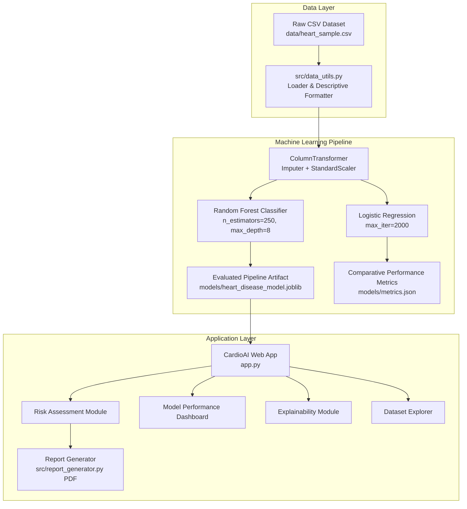

# CardioAI 🫀

**Intelligent Cardiovascular Risk Assessment**

CardioAI is a production-style, machine learning-powered web application designed for interactive cardiovascular risk prediction, clinical feature explainability, and dataset exploration. Built using Python, Scikit-learn, Streamlit, and Plotly, CardioAI provides an intuitive SaaS analytics dashboard for educational and research use.

---

## 📌 Overview

CardioAI transforms patient demographic, physiological, and clinical measurement inputs into actionable model-predicted risk assessments. The system integrates a robust Random Forest classifier, median imputation and standard scaling pipelines, interactive Plotly visualizations, feature importance explainability rankings, and downloadable PDF clinical reports.

> **⚠️ MEDICAL DISCLAIMER**  
> *For educational and research purposes only. This tool does not provide medical diagnosis or replace professional medical advice.*

---

## ✨ Key Features

- **🫀 Risk Assessment Engine**: Multi-section clinical input form with unit formatting, validation limits, and instantaneous probability scoring.
- **📊 Dynamic Gauge & Probability Display**: Visual categorization into *Lower Risk* (< 35%), *Moderate Risk* (35%–65%), and *Higher Risk* (> 65%).
- **💡 Model Explainability (XAI)**: Global feature importance rankings and single-patient risk factor contributions using Random Forest split weights.
- **📈 Performance Dashboard**: Interactive evaluation metrics (Accuracy, ROC-AUC, Precision, Recall, F1 Score) with confusion matrix heatmaps and ROC curves.
- **⚔️ Algorithm Comparison**: Side-by-side performance benchmarking of Random Forest vs. Logistic Regression.
- **🔍 Dataset Insights Explorer**: Exploratory data analysis (EDA) with feature distributions, target class balance, and correlation heatmaps.
- **📄 Downloadable PDF Assessment Report**: Automated report generation built with ReportLab, complete with assessment timestamps, entered parameters, risk metrics, and medical disclaimers.
- **🧪 Automated Unit Testing**: Comprehensive test suite using `pytest` covering dataset loading, model pipeline fitting, prediction scoring, and parameter validation.

---

## 🏗️ Architecture & ML Pipeline



---

## 🤖 Algorithms & Model Performance

CardioAI evaluates multiple machine learning classifiers on a stratified 80/20 train-test split:

| Model Algorithm | Accuracy | Precision | Recall | F1 Score | ROC-AUC |
| :--- | :---: | :---: | :---: | :---: | :---: |
| **Random Forest Classifier** | **86.89%** | **91.49%** | **91.49%** | **0.915** | **0.909** |
| Logistic Regression | 78.69% | 92.50% | 78.72% | 0.851 | 0.894 |

*Note: Metrics calculated on the held-out 20% test dataset (61 patient samples).*

---

## 📋 Input Features (13 Clinical Parameters)

| Feature | Label | Domain Category | Unit / Options |
| :--- | :--- | :--- | :--- |
| `age` | Age | Patient Profile | years (18–120) |
| `sex` | Biological Sex | Patient Profile | 0: Female, 1: Male |
| `trestbps` | Resting Blood Pressure | Cardiovascular Measurements | mmHg (80–250) |
| `chol` | Serum Cholesterol | Cardiovascular Measurements | mg/dL (100–600) |
| `thalach` | Maximum Heart Rate | Cardiovascular Measurements | bpm (60–220) |
| `cp` | Chest Pain Type | Clinical Indicators | 0: Typical, 1: Atypical, 2: Non-anginal, 3: Asymptomatic |
| `fbs` | Fasting Blood Sugar | Clinical Indicators | 0: ≤ 120 mg/dL, 1: > 120 mg/dL |
| `restecg` | Resting ECG | Clinical Indicators | 0: Normal, 1: ST-T Wave Abnormality, 2: LVH |
| `exang` | Exercise-Induced Angina | Clinical Indicators | 0: No, 1: Yes |
| `oldpeak` | ST Depression | Clinical Indicators | mm (0.0–10.0) |
| `slope` | ST Segment Slope | Clinical Indicators | 0: Upsloping, 1: Flat, 2: Downsloping |
| `ca` | Major Vessels | Clinical Indicators | 0–4 vessels colored by fluoroscopy |
| `thal` | Thalassemia Result | Clinical Indicators | 0: Unknown, 1: Normal, 2: Fixed Defect, 3: Reversible Defect |

---

## 📁 Repository Structure

```
heart_disease_prediction_ml/
├── .streamlit/
│   └── config.toml          # Streamlit theme branding configuration
├── data/
│   └── heart_sample.csv     # 303-record Cleveland heart disease dataset
├── models/                  # Saved model artifacts & JSON metadata (gitignored)
│   ├── .gitkeep
│   ├── feature_importance.json
│   ├── heart_disease_model.joblib
│   ├── metrics.json
│   └── model_metadata.json
├── scripts/
│   └── generate_dataset.py  # Dataset populator script
├── src/
│   ├── __init__.py
│   ├── config.py            # Metadata, feature definitions, and theme styling tokens
│   ├── data_utils.py        # Data loading, validation, and descriptive formatting
│   ├── explainability.py    # Feature importance extraction and patient key factor analysis
│   ├── model_utils.py       # Scikit-learn pipeline, evaluation, and prediction engine
│   ├── report_generator.py  # ReportLab PDF report generation
│   └── validation.py        # Physiological parameter range validation
├── tests/
│   ├── __init__.py
│   ├── test_data.py         # Unit tests for data loading & preprocessing
│   ├── test_model.py        # Unit tests for model training & prediction
│   └── test_validation.py   # Unit tests for input validation
├── app.py                   # Streamlit production multi-page application
├── predict.py               # Command-line prediction interface
├── train_model.py           # Model training and evaluation script
├── requirements.txt         # Project dependencies
├── .gitignore               # Git exclude rules
└── README.md                # Project documentation
```

---

## ⚙️ Installation & Local Setup

### 1. Clone the repository
```bash
git clone https://github.com/your-username/heart_disease_prediction_ml.git
cd heart_disease_prediction_ml
```

### 2. Install dependencies
```bash
python -m pip install -r requirements.txt
```

### 3. Train the machine learning pipeline
```bash
python train_model.py
```

### 4. Run the Streamlit web application
```bash
python -m streamlit run app.py
```

---

## 🧪 Running Automated Tests

Execute the automated test suite with `pytest`:
```bash
python -m pytest
```

---

## ☁️ Deployment Instructions (Streamlit Community Cloud)

1. Push your updated code to GitHub.
2. Visit [Streamlit Community Cloud](https://streamlit.io/cloud) and log in.
3. Click **New app**, select your repository and branch (`main`).
4. Set **Main file path** to `app.py`.
5. Click **Deploy**. (The application will automatically initialize the dataset and train the model binary on first launch if required).

---

## 📜 Medical Disclaimer

> CardioAI is strictly an educational machine learning research project. It does not provide medical diagnosis, clinical decision support, or replacement for qualified medical professionals. Always consult a certified healthcare practitioner for cardiovascular diagnostic advice.
